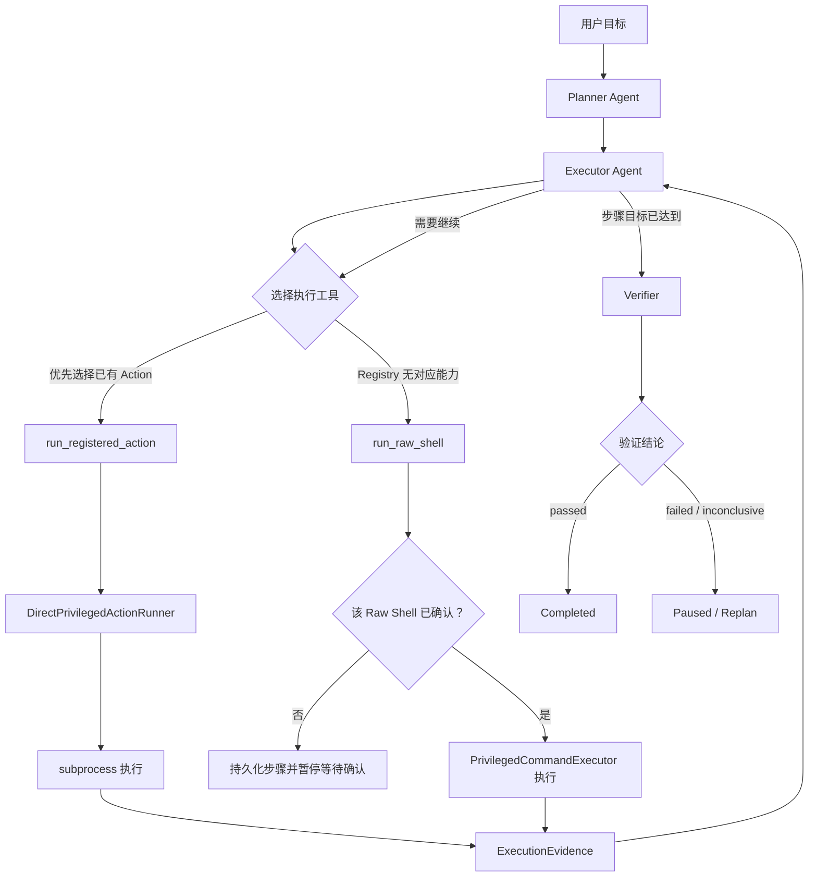
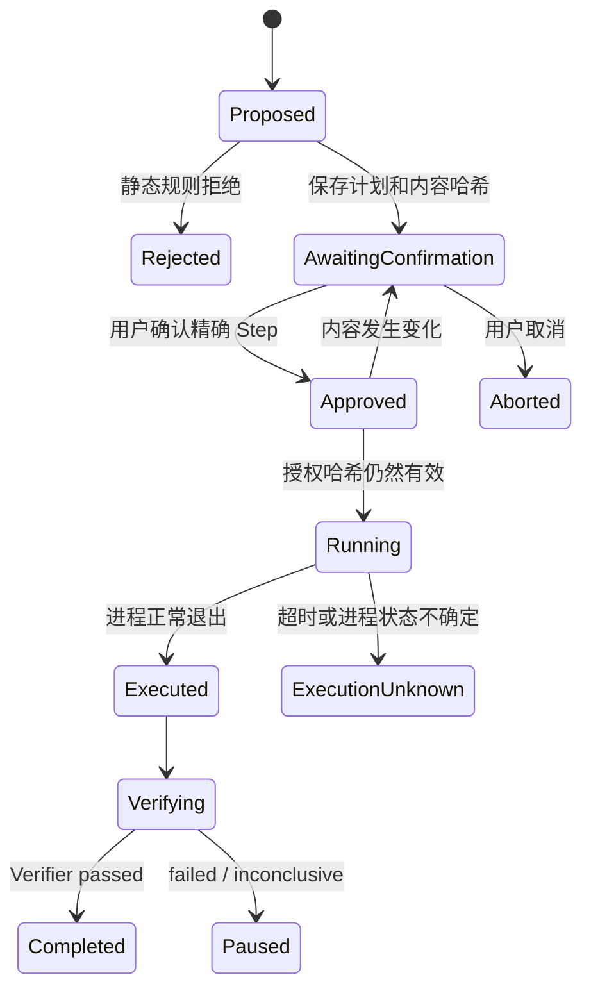

# Ops-Privilege Executor Agent 与 Raw Shell 兜底升级设计

## 1. 背景

当前 `ops-privilege` 使用自适应 Plan–Execute–Verify 工作流，但执行层仍然是确定性的机械执行器：

```text
Planner
  -> 生成注册 Action + args
  -> PrivilegedCommandExecutor
  -> DirectPrivilegedActionRunner
  -> Verifier
```

这种实现具有明确的权限和验证边界，但存在明显的能力扩展问题：

- Planner 只能生成已经注册的 Action。
- 新的真实运维场景无法映射到现有 Action 时，计划会直接失败或阻塞。
- 为修复长尾场景，需要不断增加 Action、参数校验、Runner Handler 和 Checker。
- 系统逐渐陷入“发现一个缺失能力 -> 注册一个新 Action -> 重新发布”的循环。
- 当前 `PrivilegedCommandExecutor.execute()` 还保留 `step.command -> shell=True` 的兼容路径，但该路径没有被建模为正式、可审批、可审计的执行模式。

本次升级不删除现有 Action Registry，而是在它之外增加经过人工确认的 Raw Shell 兜底路径，并把机械 Executor 升级为能够循环选择工具的 Executor Agent。

## 2. 目标

升级后的 `ops-privilege` 应满足：

1. Planner 继续负责目标分解、步骤顺序、风险上限和验收条件。
2. Executor Agent 根据计划和执行反馈循环选择工具。
3. Executor Agent 只有两个执行工具：
   - `run_registered_action`
   - `run_raw_shell`
4. 已有结构化 Action 时优先使用 Action。
5. Registry 无法覆盖的长尾操作可以生成原生 Bash。
6. Raw Shell 在真实服务器上执行，但执行前必须展示完整内容并由用户逐步骤确认。
7. 用户确认绑定计划内容哈希；脚本、工作目录、权限或验证条件变化后，原确认自动失效。
8. Raw Shell 执行后仍然进入 Verifier，退出码为零不直接等于任务完成。
9. 保留灾难命令硬拒绝、超时、审计、恢复和敏感信息脱敏。

## 3. 非目标

第一阶段明确不做：

- 不引入 Docker 或 Firecracker 沙箱。
- 不新增独立的 Privileged Execution Broker 服务。
- 不删除或重写现有 `DirectPrivilegedActionRunner`。
- 不在第一版引入复杂的 Capability Resolver、向量检索或第二个命令分类模型。
- 不允许 Raw Shell 绕过 Action 的失败、参数校验或权限拒绝。
- 不自动执行未经确认的 Raw Shell。
- 不把 sudo 密码传入模型上下文、命令、环境变量、日志或 stdin。

## 4. 总体架构



系统继续保留现有 Supervisor/Workflow 作为唯一协调入口。Executor Agent 不能绕过 Workflow 直接调用 `subprocess`。

## 5. 组件职责

### 5.1 Planner Agent

Planner 负责：

- 将用户目标拆分为可验证步骤。
- 为步骤提供目标、目标对象、风险上限和验收条件。
- 已知 Action 能表达时优先给出 `preferred_action` 和结构化参数。
- 不直接执行工具。
- 不直接授权 Raw Shell。
- 不为了通过校验而编造 Action 名称、路径、服务名或参数。

Planner 步骤建议逐步从“只有 Action”扩展为：

```json
{
  "step_id": "restart-master",
  "title": "重启 Klonet Master 服务",
  "goal": "让 vemu-master-flask.service 使用最新代码恢复运行",
  "preferred_action": "manage_service",
  "preferred_args": {
    "operation": "restart",
    "service": "vemu-master-flask.service"
  },
  "risk_ceiling": "high",
  "success_criteria": [
    "vemu-master-flask.service 状态为 active",
    "本地健康检查通过"
  ]
}
```

为了降低第一阶段改造范围，已有 `action + args` 字段继续兼容；`preferred_action` 可以先映射到现有字段。

### 5.2 Executor Agent

Executor Agent 负责：

- 接收一个 Planner Step，而不是重新理解整个用户请求。
- 读取当前步骤、Action Catalog、环境证据和历史执行结果。
- 优先调用注册 Action。
- 根据 Action 返回结果继续观察和推进。
- Registry 确实没有对应操作时，生成 Raw Shell 提案。
- 判断证据是否足以交给 Verifier。
- 在达到循环、时间、变更或风险预算时暂停。

Executor Agent 不负责：

- 用户审批。
- 修改授权状态。
- 自己运行 `subprocess`。
- 判断最终目标已经可信完成。
- 在 Raw Shell 等待确认时继续生成替代命令。

建议限制：

```text
max_iterations_per_step = 5
max_mutating_tool_calls_per_step = 2
max_raw_shell_proposals_per_step = 1
```

只读观察由现有环境 Context/Probe 体系提供，或者作为只读注册 Action 调用；它不形成第三条高权限执行路径。

### 5.3 Verifier

Verifier 保持独立：

- 只根据计划验收条件、执行证据和 Checker 结果判断。
- 不能因为 Executor Agent 声称成功就返回 `passed`。
- Raw Shell 退出码为零但缺少目标状态证据时，返回 `inconclusive` 或 `partial`。
- 执行超时、状态未知或必要 Checker 不可用时，不得返回 `passed`。

## 6. Executor Agent 的两个工具

### 6.1 `run_registered_action`

接口：

```python
run_registered_action(
    action: str,
    args: dict,
) -> ActionObservation
```

Executor Agent 调用示例：

```json
{
  "action": "manage_service",
  "args": {
    "operation": "restart",
    "service": "vemu-master-flask.service"
  }
}
```

工具内部：

```text
查 OpsActionRegistry
  -> 规范化 alias
  -> 校验 Action 是否注册
  -> 校验 Action 是否由 DirectPrivilegedActionRunner 实现
  -> 校验 required args
  -> 校验路径、服务名和 Action 语义
  -> 检查风险和授权
  -> 构造 PrivilegedStep
  -> 调用 DirectPrivilegedActionRunner
  -> 返回结构化 Observation
```

现有 `DirectPrivilegedActionRunner` 继续作为实现后端。它通过 `_action_<name>` Handler 将结构化参数编译为确定性的 argv 或本地文件操作。例如：

```python
argv = [
    "sudo",
    "systemctl",
    operation,
    service,
]

subprocess.run(
    argv,
    shell=False,
)
```

第一阶段不再因为长尾用户需求继续无条件扩充 Handler。只有同时满足以下条件的操作才值得新增正式 Action：

- 高频出现；
- 参数和影响范围能够稳定结构化；
- 需要自动执行而不希望每次 Raw Shell 确认；
- 可以提供可靠的确定性验证；
- 注册后能够显著降低风险或提高复用性。

#### ActionObservation

工具返回结构化结果：

```json
{
  "status": "completed",
  "action": "manage_service",
  "return_code": 0,
  "stdout": "",
  "stderr": "",
  "environment_changed": true,
  "error_category": "",
  "retryable": false,
  "suggested_next_action": ""
}
```

失败时应尽量给出稳定的错误类别，例如：

- `action_not_registered`
- `capability_not_implemented`
- `invalid_args`
- `permission_denied`
- `precondition_failed`
- `execution_failed`
- `execution_timeout`
- `environment_changed_unknown`

只有 `action_not_registered` 和 `capability_not_implemented` 可以自然进入 Raw Shell fallback。Action 已执行失败、参数错误、权限拒绝或前置条件失败时，不允许 Executor Agent 用 Raw Shell 自动绕过。

### 6.2 `run_raw_shell`

接口：

```python
run_raw_shell(
    command: str,
    cwd: str,
    requires_sudo: bool,
    fallback_reason: str,
    expected_changes: list[str],
    postconditions: list[dict],
    timeout: int,
) -> RawShellObservation
```

虽然工具名是 `run_raw_shell`，但第一次调用不一定执行。工具内部先检查当前步骤是否已经对完全相同的内容完成授权：

```python
if not exact_step_is_approved(step):
    persist_pending_step(step)
    return approval_required(step)

return execute_approved_raw_shell(step)
```

Executor Agent 调用示例：

```json
{
  "command": "set -euo pipefail\ncd /home/lzl/102\npython manage.py migrate_custom --tenant test",
  "cwd": "/home/lzl/102",
  "requires_sudo": false,
  "fallback_reason": "Registry 中没有项目自定义数据库迁移 Action",
  "expected_changes": [
    "test 租户数据库结构更新"
  ],
  "postconditions": [
    {
      "checker": "exit_code_zero",
      "args": {}
    }
  ],
  "timeout": 300
}
```

工具第一次返回：

```json
{
  "status": "approval_required",
  "plan_id": "priv-123",
  "step_id": "raw-shell-1",
  "message": "Raw Shell 已保存，等待用户确认"
}
```

Workflow 随后暂停 Executor Agent 循环，不允许 Agent 在同一次调用里修改命令或继续尝试。

## 7. Raw Shell Step 数据契约

在 `PrivilegedStep` 中增加显式执行模式：

```python
EXECUTION_MODES = {
    "registered_action",
    "raw_shell",
    "readonly",
}
```

建议新增字段：

```python
execution_mode: str = "registered_action"
requires_sudo: bool = False
fallback_reason: str = ""
```

继续复用现有字段：

```python
command
cwd
risk
timeout
expected_changes
postconditions
approval_scope
status
evidence
```

三种模式必须互斥：

```text
registered_action:
  action 必填
  args 为 object
  command 必须为空

raw_shell:
  command 必填
  action 必须为空
  approval_scope 必须为 step

readonly:
  command 必填
  risk 必须为 readonly
  必须通过 readonly_argv 校验
```

这会替换当前不够明确的行为：

```python
if step.action:
    execute_action(step)
else:
    execute(step.command, shell=True)
```

升级后，没有 Action 不再自动等于允许 Shell；只有显式 `execution_mode == "raw_shell"` 且完成授权后才能执行。

## 8. Raw Shell 校验和风险规则

Raw Shell 提案进入审批前至少校验：

- 命令非空并限制最大长度。
- 拒绝 NUL 字节和非法编码。
- `cwd` 必须是存在的绝对路径，并在允许范围内。
- 命令中不得包含密码、Token 或私钥内容。
- 禁止 `sudo -S`、`echo password | sudo` 等密码传输方式。
- 复用当前 catastrophic hard-deny 规则。
- 必须声明 fallback 原因、预期变化和验证条件。
- `requires_sudo=true` 时风险下限为 `high`。
- 非 sudo Raw Shell 风险下限为 `medium`。
- Raw Shell 必须逐步骤确认。

第一阶段继续硬拒绝：

- `rm -rf /` 及等价根目录递归删除；
- `mkfs`、磁盘分区和明显磁盘覆写；
- fork bomb；
- 通过 stdin 注入 sudo 密码；
- 明显的密钥、凭据或用户目录数据外传；
- 无边界的系统级递归删除。

模型可以提高风险，不能降低确定性规则给出的风险下限。

## 9. Raw Shell 审批状态机



用户确认时复用当前：

```text
confirm-priv-step <plan_id> <step_id>
```

授权继续绑定 `PrivilegedPlan.content_hash`。以下任一内容变化后必须重新确认：

- command；
- cwd；
- requires_sudo；
- timeout；
- risk；
- expected_changes；
- preconditions/postconditions；
- rollback。

## 10. Raw Shell 真实执行

第一阶段不增加 Broker，由现有 `PrivilegedCommandExecutor` 新增明确的 `execute_raw_shell()`。

不再使用隐式：

```python
subprocess.Popen(
    step.command,
    shell=True,
)
```

建议使用固定 Bash argv，并通过 stdin 传入已经确认的脚本文本：

```python
argv = [
    "/bin/bash",
    "--noprofile",
    "--norc",
    "-s",
]

if step.requires_sudo:
    argv = [
        "sudo",
        "--non-interactive",
        *argv,
    ]

process = subprocess.Popen(
    argv,
    shell=False,
    cwd=step.cwd or None,
    stdin=subprocess.PIPE,
    stdout=subprocess.PIPE,
    stderr=subprocess.PIPE,
    text=True,
    start_new_session=True,
)

stdout, stderr = process.communicate(
    input=step.command,
    timeout=step.timeout,
)
```

这样仍然允许 LLM 自由生成原生 Bash，但避免在外层再次做 Shell 字符串拼接。

如果服务器 sudoers 不允许非交互执行，该步骤明确失败，不得要求 Executor Agent 把密码写入命令。

超时后必须终止整个进程组，而不只是 Bash 父进程：

```text
SIGTERM process group
  -> 短暂等待
  -> 仍未退出则 SIGKILL process group
```

超时或中断后：

```text
step.status = execution_unknown
environment_changed = unknown
```

系统不得自动重放该命令。

## 11. 结构化 Action 优先规则

第一阶段不实现复杂语义 Capability Resolver，采用 Prompt 约束、工具返回状态和审批门共同保证。

Executor Agent 系统提示词必须明确：

```text
你有两个执行工具：

1. run_registered_action
2. run_raw_shell

必须优先从提供的 Action Catalog 中选择能够完成当前步骤的注册 Action。

只有 Registry 不存在对应 Action，或者工具明确返回
action_not_registered / capability_not_implemented 时，才可以调用
run_raw_shell。

不得因为参数错误、执行失败、权限不足、前置条件失败或验证失败而改用
Raw Shell 绕过结构化 Action 的约束。
```

`run_raw_shell` 要求 `fallback_reason`，并将它写入计划和审计事件。由于 Raw Shell 始终需要用户确认，第一阶段允许模型承担自然语言到 Action Catalog 的匹配工作。

如果 Eval 发现 Executor Agent 经常错误绕过 Action，再增加代码级 Capability Resolver；该能力不是第一阶段上线前置条件。

## 12. Executor Agent 循环

伪代码：

```python
def execute_step(step, context):
    observations = []

    for iteration in range(MAX_ITERATIONS):
        decision = executor_agent.decide(
            step=step,
            action_catalog=context.action_catalog,
            environment_evidence=context.environment_evidence,
            observations=observations,
        )

        if decision.tool == "run_registered_action":
            result = run_registered_action(
                action=decision.action,
                args=decision.args,
            )
            observations.append(result)

        elif decision.tool == "run_raw_shell":
            result = run_raw_shell(
                command=decision.command,
                cwd=decision.cwd,
                requires_sudo=decision.requires_sudo,
                fallback_reason=decision.fallback_reason,
                expected_changes=decision.expected_changes,
                postconditions=decision.postconditions,
                timeout=decision.timeout,
            )

            if result.status == "approval_required":
                return pause_workflow(result)

            observations.append(result)

        elif decision.tool == "finish_step":
            return verifier.verify(step, observations)

        elif decision.tool == "report_blocked":
            return blocked(decision.reason)

    return paused("executor_iteration_limit_reached")
```

`finish_step` 和 `report_blocked` 是 Agent 的控制输出，不是高权限执行工具，因此不计入“两种执行工具”。

## 13. 失败处理

### 13.1 注册 Action 失败

| 失败类型 | Executor 行为 |
|---|---|
| `action_not_registered` | 可以提出 Raw Shell |
| `capability_not_implemented` | 可以提出 Raw Shell |
| `invalid_args` | 修正参数或重新规划，不得 Shell 绕过 |
| `precondition_failed` | 先只读诊断或暂停 |
| `permission_denied` | 暂停并报告权限问题 |
| `execution_failed` | 进入诊断/验证，不自动 Shell 重试 |
| `execution_timeout` | 标记执行状态未知，不自动重放 |

### 13.2 Raw Shell 失败

- 未通过静态规则：直接拒绝，不创建可执行授权。
- 等待确认：暂停整个 Executor Agent 循环。
- 用户取消：步骤标记 aborted/skipped，不执行。
- 非零退出：进入 Verifier/恢复流程，不自动改写并重试。
- 超时或连接中断：标记 `execution_unknown`。
- 验证失败：暂停或重新规划；任何新脚本都必须重新确认。

## 14. 持久化与审计

继续使用：

```text
memory/sessions/{user_id}/{project_id}/privileged_ops_plans/{plan_id}.json
```

新增或扩展审计事件：

- `privileged_executor_iteration`
- `privileged_action_selected`
- `privileged_action_finished`
- `privileged_raw_shell_proposed`
- `privileged_raw_shell_approved`
- `privileged_raw_shell_rejected`
- `privileged_raw_shell_started`
- `privileged_raw_shell_finished`
- `privileged_verification`

Raw Shell 审计至少记录：

- plan_id / step_id；
- 完整脚本或受访问控制的脚本引用；
- content hash；
- cwd；
- requires_sudo；
- fallback_reason；
- 用户确认人和确认时间；
- 开始/结束时间；
- return code；
- timed_out；
- 有界 stdout/stderr；
- environment_changed；
- Verifier 结论。

所有输出继续使用现有敏感信息脱敏逻辑。

## 15. 代码改造范围

建议新增：

```text
ops/privileged/executor_agent.py
  PrivilegedExecutorAgent
  ExecutorDecision
  ExecutorObservation

ops/privileged/executor_tools.py
  RunRegisteredActionTool
  RunRawShellTool
```

建议修改：

```text
ops/privileged/contracts.py
  增加 execution_mode、requires_sudo、fallback_reason
  增加执行模式互斥校验

ops/privileged/executor.py
  保留 execute_action()
  保留 execute_readonly()
  新增 execute_raw_shell()
  删除“没有 action 就隐式 shell=True”的默认行为
  超时终止进程组

ops/privileged/workflow.py
  接入 Executor Agent 循环
  Raw Shell 第一次调用时持久化并暂停
  confirm-priv-step 后恢复执行
  新增 Action/Raw Shell 审计事件

ops/privileged/planner.py
  保留结构化 Action 优先
  允许无法映射 Action 的语义步骤进入 Executor Agent
  不再因为缺失 Action 就整体计划失败

ops/privileged/policy.py
  Raw Shell 风险下限
  灾难命令硬拒绝
  sudo 密码传输拒绝

ops/privileged/summarizer.py
  展示 Raw Shell、cwd、执行身份、预期影响和验证方式
```

现有 `ops/privileged/action_runner.py` 第一阶段只做必要的结构化返回适配，不进行大规模重构。

## 16. 测试设计

### 16.1 Action Runner

- Executor Agent 优先选择存在的 Action。
- Action alias 正确解析。
- 参数不合法时不执行 subprocess。
- 路径越界时不执行。
- Action Handler 使用确定性 argv。
- Action 返回结构化 Observation。
- Action 失败不会自动触发 Raw Shell 绕过。

### 16.2 Raw Shell 审批

- 未确认 Raw Shell 不执行 subprocess。
- 第一次调用保存计划并返回 `approval_required`。
- 确认后执行精确脚本。
- 修改 command 后授权失效。
- 修改 cwd、sudo、timeout 或 postconditions 后授权失效。
- 已使用授权不能隐式重放。
- 用户取消后不执行。

### 16.3 Raw Shell 安全

- `requires_sudo=true` 风险至少为 high。
- Raw Shell 必须 step 级确认。
- `sudo -S` 和密码管道被拒绝。
- 灾难命令被硬拒绝。
- cwd 越界被拒绝。
- 输出按上限截断和脱敏。
- 超时终止进程组并返回 `execution_unknown`。

### 16.4 Executor Agent

- 每个步骤最多循环指定次数。
- Action 不存在时允许生成 Raw Shell 提案。
- Action 参数错误时不能 Raw Shell 绕过。
- Raw Shell 等待确认后 Agent 循环立即暂停。
- 恢复后使用持久化脚本，不重新调用模型生成脚本。
- `finish_step` 后必须进入 Verifier。

### 16.5 Verifier

- Raw Shell 退出码为零但 Checker 失败时不完成计划。
- Checker 不可用时返回 partial/inconclusive。
- 超时或 execution_unknown 时不得 passed。
- 新脚本重规划后必须重新确认。

## 17. 分阶段迁移

### 阶段一：显式 Raw Shell 契约

- 为 `PrivilegedStep` 增加执行模式。
- 把隐式 `shell=True` 路径改为显式 `execute_raw_shell()`。
- 接入逐步骤确认、哈希绑定、风险下限和灾难命令拒绝。
- 暂时不引入 Executor Agent。

这样可以先封住当前遗留的原生命令旁路。

### 阶段二：Executor Agent 双工具循环

- 新增 `PrivilegedExecutorAgent`。
- 将现有 Action Runner 包装成 `run_registered_action`。
- 将显式 Raw Shell 路径包装成 `run_raw_shell`。
- 接入循环次数、执行次数和暂停恢复。

### 阶段三：Planner 语义步骤

- Planner 从“必须输出 Action”调整为“优先输出 Action，无法覆盖时输出语义步骤”。
- Executor Agent 负责运行时选择 Action 或 Raw Shell。
- 保留现有 Action Plan 的兼容读取和恢复。

### 阶段四：真实场景 Eval

使用现有历史会话 Eval 检查：

- 结构化 Action 命中率；
- Raw Shell fallback 比例；
- 错误绕过 Action 的比例；
- Raw Shell 确认后成功率；
- Verifier 的完整/部分验证比例；
- Action 是否仍然需要频繁新增。

只有 Eval 证明 Prompt 约束不足时，再设计代码级 Capability Resolver。

## 18. 验收标准

- Executor Agent 只有两个高权限执行工具。
- 已注册能力默认走 `run_registered_action`。
- Registry 不支持的操作可以进入 Raw Shell 提案。
- 未确认 Raw Shell 永不执行。
- Raw Shell 确认内容与执行内容通过现有计划哈希绑定。
- Raw Shell 内容变化后必须重新确认。
- Action 失败不能被 Raw Shell 自动绕过。
- 灾难命令继续硬拒绝。
- Executor Agent 的循环有明确预算。
- Action 和 Raw Shell 都生成统一 `ExecutionEvidence`。
- 两条执行路径都必须经过 Verifier。
- 当前持久化计划、控制命令和恢复机制保持兼容。

## 19. 最终架构表述

该升级可以概括为：

> 在 Ops-Privilege 自适应 PEV 工作流中引入工具调用型 Executor Agent，通过“结构化 Action 优先、原生 Shell 人工审批兜底”的双通道执行架构，在保留真实服务器运维能力的同时，解决 Action Registry 对长尾运维场景覆盖不足和持续膨胀的问题；所有变更继续受到计划哈希授权、风险分级、执行审计和独立 Verifier 的约束。
